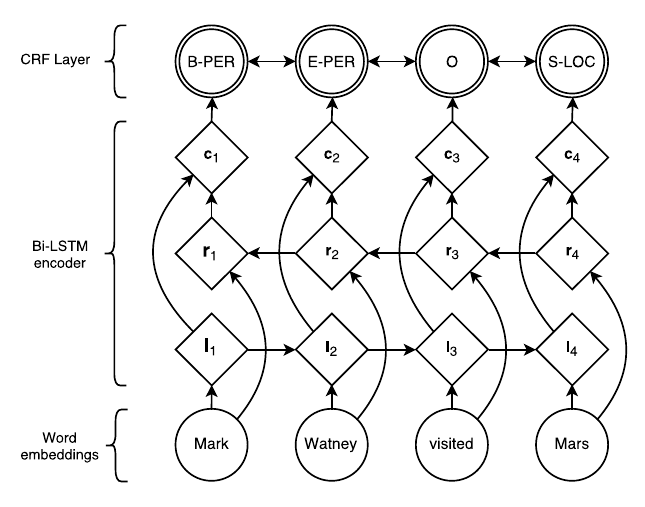
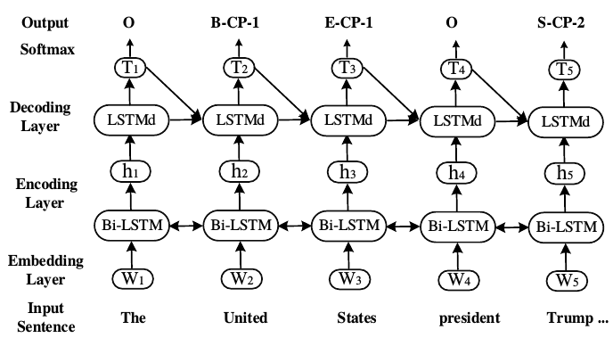

## 方案

[比赛链接 点击此处](https://biendata.com/competition/sohu2019/)，比赛的主要任务是给定若干文章，目标是判断文章的核心实体以及对核心实体的情感态度。

我的方案是将核心实体以及对核心实体的情感态度的判别看成是一个序列标注问题，即在标注出实体的时候同时标注情感。举个例子，假设新闻中有这么一句：

> 华润医药宣布一把手换人，王春城任董事会主席。

并且该新闻对应的核心实体为 `华润医药`、`王春城`，新闻对这两个核心实体的情感为` NORM`、`NORM`，那么上述这句话可以标注为：

```
华  NORM_B
润  NORM_I
医  NORM_I
药  NORM_E
宣  O
布  O
一  O
把  O
手  O
换  O
人  O
，  O
王  NORM_B
春  NORM_I
城  NORM_E
任  O
董  O
事  O
会  O
主  O
席  O
。  O
```

**常规的做法**可能是先抽取出实体，然后再根据实体判别文章对它的态度，这样的话就要设计两个系统分别用于实体抽取以及情感识别，并且情感识别的输入严重依赖于实体抽取的结果。比起常规的做法，将实体抽取、以及情感识别这两个过程看成是一个**序列标注问题**，可以有效地将问题简化。

解决序列标注问题的常规模型就是`BiLSTM+CRF`。

为了解决这个序列标注问题，目前主要尝试了以下两种模型：

* 常规的**BiLSTM+CRF**，图来自[论文](https://www.aclweb.org/anthology/N16-1030)



* 双层的**LSTM** ，参考自[论文](https://arxiv.org/pdf/1706.05075.pdf)




基于以上的思想，我多次尝试，并且使用了基于字或者基于词（先分词再进行标注）作为不同的标注方案，同时在每种方案下选择不同的超参数来训练多个模型，最后将这些模型的在测试集上的结果**ensemble**，不断尝试，就得到了最后的结果（初赛26名，分数是0.45382）。


## 快速复现

1. 安装依赖（基于**python3.6.3** ， pytorch1.0)：

   ```shell
   pip3 install -r requirement.txt
   ```

2. 目前的最好的结果是`results/best_now.txt`文件。主要是使用`BiLSTM＋CRF`模型的结果进行`ensemble`的结果。复现的话运行即可：

   ```shell
   python3 ensemble.py
   ```

   运行结束后会在`results`下生成`tmp.txt`文件，用于提交。

   **说明**：我当前的最好结果为**0.4538**，这个结果是在许多个模型上ensemble出来的结果，因为之前代码存在bug，导致有部分模型被我**删掉**了(由于不知道中期可能需要进行提交，目前没有详细记录ensemble的相关过程...）， 所以这样运行出来的结果可能会差点，只能大约接近这个结果！


## 从头复现

如果想要从数据处理开始复现结果：

* 将原始数据（`coreEntityEmotion_train.txt` 以及`coreEntityEmotion_test_stage1.txt`等文件）放到目录`SohuData/original_data`下面，然后运行:

  ```shell
  python3 preprocess.py
  ```

  进行数据预处理（生成标注，分词等工作)

* 下载预训练的词向量：[下载链接](https://pan.baidu.com/s/1pUqyn7mnPcUmzxT64gGpSw)（该词向量来自  [100+ Chinese Word Vectors 上百种预训练中文词向量](https://github.com/Embedding/Chinese-Word-Vectors)）

  解压下载的词向量文件，在`config.py`中修改`word2vec_path`参数为词向量的路径。

* 之后就可以，在`config.py`设置模型的不同的参数，然后运行：

  ```shell
  python3 main.py
  ```

  训练完毕之后，程序会将模型的相关信息以及在验证集、测试集上的结果保存到`ckpts`目录下对应的文件夹。

* 按照上一步的做法，手动调整参数，训练多个模型，之后通过**ensemble**将这些模型的结果结合起来，用于提交。


##　 代码的目录结构

```shell
.
├── analysis            # 用于分析数据的一些py文件
├── ckpts               # 保存模型
├── config.py           # 设置模型参数
├── data                # 处理数据的文件
├── ensemble.py         # 用于ensemble
├── imgs                # 保存README.md使用的图片
├── main.py             # 训练模型
├── models              # 定义模型
├── preprocess.py       # 数据预处理
├── README.md
├── requirement.txt     # 需求文件
├── results             # 保存ensemble的结果
├── SohuData            # 原始数据以及处理后的数据
├── training.py         # 定义训练模型评估模型的函数
└── utils               # 工具函数

```


## 可以改进的地方

* 改进ensemble的策略

* 试一下不同的模型:

  * An attention-based BiLSTM-CRF approach to document-level chemical ner
  * End-to-end Sequence Labeling via Bi-directional LSTM-CNNs-CRF
  * [A Survey on Recent Advances in Named Entity Recognition from DeepLearning models](https://aclweb.org/anthology/C18-1182)

* **Bert** for seqence labeling


